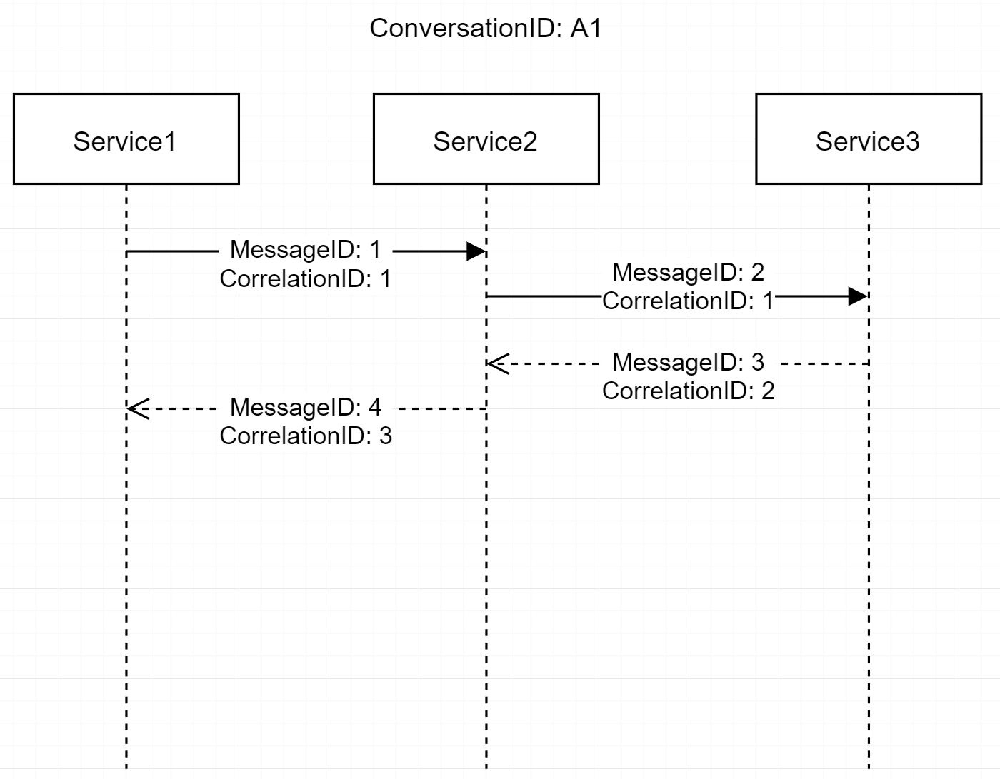

## Proof of Concept

### Current Functionality
- Establish message semantics
    - **Send**: Commands. These are sent to a queue for which there should be *one* consumer (multiple instances is fine).
    - **Publish**: Events. These are messages that are broadcast to zero or more consumers.
- Establish enterprise messaging patterns
    - **MessageId**: The unique ID of the message itself
    - **CorrelationId**: The MessageID of the message that caused "this" message. For example, if MessageB is in response to MessageA, then Message A's MessageId will be MessageB's CorrelationID
    - **ConversationId**: The ID of all messages that are part of the same transaction.

{:height="50%" width="50%"}

- Handle incoming messages by convention. To deal with an incoming message (Queue or Topic), simply implement the interface `IHandleMessages<T>` where T is the type of the incoming message. Handlers are dependency injected.
- To deal with scenarios where the original message type is not available to the consumer assembly (i.e. did not originate from, or message is not in a shared library), allow the means to manually resolve the message type to another message type.
- Headers that are added via `SendOptions` are copied to every message in the conversation. Use this add additional metadata between messages that don't really fit into the message.

The usage of Queues vs. Topics is the explained above, but any service that wishes to receive messages must have it's own queue. This is done by setting the `EndpointName` property in the configuration. The `EndpointName` will be used as the queue name and any messages sent to this queue will be received by that service.

### Example Setup

``` csharp
public void ConfigureServices(IServiceCollection services)
{
    services.AddAzureServiceBus(config =>
        {
            config.UseAppSettings(Configuration);
            config.ScanAssemblies(Assemblies.ContainingTypes(typeof(Startup)));
            config.UseTypeResolver<TestResolver>();
            config.WithSubscriptions(builder =>
            {
                builder.ConsumeTopic("test-foo", "Test-Poc");
                builder.ConsumeTopic("test-bar", "Test-Poc");
            });

            if (Environment.IsEnvironment("Local"))
                config.LimitConcurrencyTo(1);
        });

    services.AddMvc().SetCompatibilityVersion(CompatibilityVersion.Version_2_2);
}
```

This example setup uses appsettings.json for basic configuration (connection string, endpoint name). There is a config builder to deal with other details. Shown here is an assembly scan whitelist, a message type resolver, concurrency limit, and a means to subscribe to topics. The subscription to the local queue will be automatically created by the installer as long as the configuration allows this service to receive messages (i.e. not `SendOnly`).

## Sending Messages
After running the installer shown above, you just need to request the `IServiceBus` service in your controllers, for example. From there, the sending interface is available for creating new messages. Here as an example from the project:

``` csharp
[Route("")]
public class TestController : Controller
{
    private readonly IServiceBus _bus;

    public TestController(IServiceBus bus)
    {
        _bus = bus;
    }

    [HttpGet, Route("test")]
    public async Task<IActionResult> TestBus()
    {
        var testCommand = new TestCommand {Message = "Hello queue!"};
        var testEvent = new TestEvent {Message = "Hello topic!"};
        var testRewire = new RewireMeCommand {Message = "I should be rewired!"};

        await _bus.SendAsync(testCommand, "app1");
        await _bus.SendLocalAsync(testRewire);
        await _bus.SendLocalAsync(testCommand);
        await _bus.PublishAsync(testEvent, "test-foo");

        return Ok();
    }
}
```

`SendLocalAsync` is a convenience method that will queue the command in the service's own queue. This is a way to defer work.

## Handling Incoming Messages
Simply implement the interface `IHandleMessage<T>` where `T` is the incoming message type.

``` csharp
public class TestEventHandler : IHandleMessages<TestEvent>
{
    public Task Handle(TestEvent message, IMessageContext context, CancellationToken cancellationToken)
    {
        // do work here
        Trace.WriteLine(message.Message);
        return Task.CompletedTask;
    }
}
```

This handler will be invoked any time a message of type `TestEvent` is received.

To send another message as a response to this received message, use the context object. This will ensure the IDs are arranged correctly and that any optional headers have been copied.

``` csharp
public async Task Handle(TestCommand message, IMessageContext context, CancellationToken cancellationToken)
{
    OutputTrace(message.Message, context);
    var reply = new TestResponse {Message = "I'm a reply!"};

    await context.SendAsync(reply, context.Source);
}
```

In this example, a reply is sent as a command directly to the source of the message. You can also publish an event to a topic using the same context. 

> You can separate every message type to its own handler or handlers can handle more than one message type. Just implement multiple `IHandleMessages<T>` interfaces on the same class.

## Custom Resolvers
Scenario:
Service A sends out message FooCommand, so its type fullname is ServiceA.FooCommand. The message can only be deserialized by Json.Net if the type can be found in the receiving assembly. The only real way to make this possible is to share the original message through something like Nuget. If this is not doable, then we can simply override the incoming type.

Let's say the incoming message is of type ServiceA.FooCommand but we don't have access to that class. Instead, we create our own in ServiceB. To tell the bus to convert that incoming message, we simply need to implement `IHandleTypeResolver`

``` csharp
public class TestResolver : IHandleTypeResolver
{
    private readonly Dictionary<string, Type> _resolver = new Dictionary<string, Type>();

    public TestResolver()
    {
        var fullname = "ServiceA.FooCommand";
        _resolver.Add(fullname, typeof(ServiceB.FooCommand));
    }

    public Type UseTypeFor(string enclosedMessageType)
    {
        return _resolver.ContainsKey(enclosedMessageType) 
            ? _resolver[enclosedMessageType] 
            : null;
    }
}
```

This sample resolver simply provides a map for the incoming type to the local class that we want to deserialize to. It is our responsibility to make sure the `UseTypeFor(string)` method is safe. The actual type of the incoming message can be found in its headers under the header type `petm:EnclosedType`. This is automatically added to every message by the library. In this example, whenever 

After implementing the resolver, you can add it by calling `config.UseTypeResolver<TestResolver>` as shown in the configuration example.

## Future Functionality
- Error queue (not deadletter queue). When a message fails to complete after so many retries, it is moved to an error queue so that the original message is not lost, and the message can be replayed.
- Sagas for managing distributed transactions
- Startup should automatically install topics and queues if they don't already exist. This will require the manage permissions.